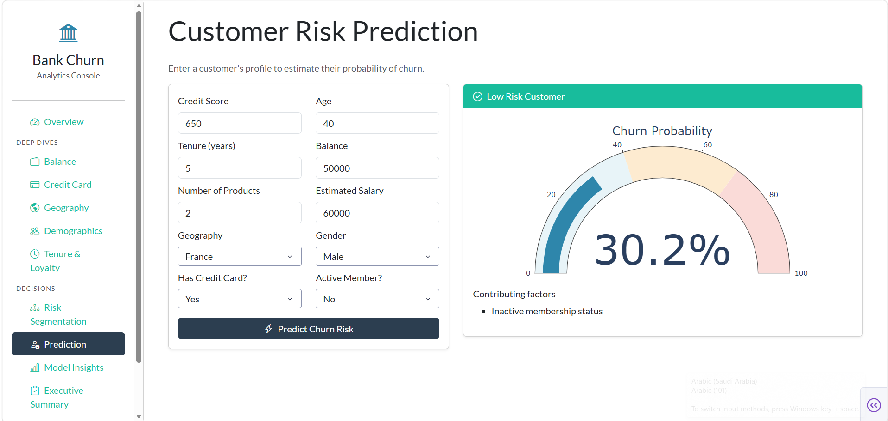
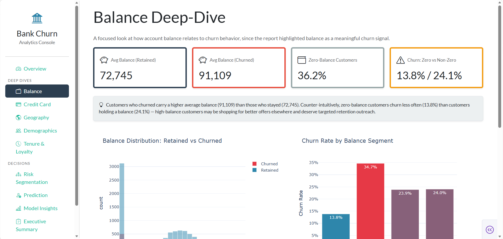

# 🏦 Bank Customer Churn Analytics Dashboard

An interactive Business Intelligence dashboard that combines Machine Learning and Data Visualization to analyze customer churn and support business decision-making.

---

# 📌 Project Overview

Customer churn is one of the biggest challenges facing banks, as losing existing customers directly impacts profitability.

This project aims to analyze customer churn behavior, identify the most influential factors behind customer attrition, and provide an interactive dashboard that helps decision-makers explore customer behavior and predict churn risk.

The dashboard combines exploratory data analysis, machine learning, and business intelligence into a single application.

---

# 🎯 Business Problem

Banks need to identify customers who are likely to leave before they actually churn.

Instead of reacting after customers leave, this dashboard helps managers proactively identify high-risk customers and design targeted retention strategies.

---

# 📂 Dataset

Dataset: **Churn_Modelling.csv**

The dataset contains information about 10,000 bank customers, including:

- Credit Score
- Geography
- Gender
- Age
- Tenure
- Balance
- Number of Products
- Credit Card Status
- Active Membership
- Estimated Salary

Target Variable:

- **Exited**
    - 0 → Customer Stays
    - 1 → Customer Leaves

---

# 🔄 Project Workflow

## 1. Exploratory Data Analysis (EDA)

- Customer behavior analysis
- Churn distribution
- Feature relationships
- Business insights

## 2. Data Preprocessing

- Missing value verification
- StandardScaler
- OneHotEncoder
- Feature transformation using ColumnTransformer

## 3. Feature Engineering

Created a new feature:

- BalancePerProduct

to better represent customer balance relative to owned products.

## 4. Machine Learning

Several classification models were evaluated:

- Logistic Regression
- Random Forest
- XGBoost
- LightGBM

The best-performing model was selected based on evaluation metrics.

## 5. Model Deployment

The trained model was integrated into an interactive Dash application for business users.

---

# 🤖 Machine Learning Pipeline

The following diagram summarizes the complete workflow of the project, starting from raw customer data and ending with business decision support through an interactive dashboard.


---

# 📊 Dashboard Pages

## 📈 Overview

- Business KPIs
- Customer Churn Rate
- Age Distribution
- Product Analysis
- Customer Activity


---

## 💰 Balance Analysis

- Balance Distribution
- Customer Balance Segmentation
- High-Value Customer Analysis

---

## 🌍 Geography Analysis

- Churn by Country
- Regional Customer Comparison

---

## 👥 Customer Demographics

- Age Analysis
- Gender Analysis

---

## ⚠ Risk Segmentation

- Customer Risk Categories
- Business Risk Indicators

---

## 🤖 Customer Prediction

Users can enter customer information and receive:

- Churn Prediction
- Churn Probability
- Risk Level

---

# 📈 Key Business Insights

Some important findings include:

- Customers with higher balances tend to churn more frequently.
- Inactive members have significantly higher churn rates.
- Customers with only one product are more likely to leave.
- Churn behavior varies across different countries.
- Age is one of the strongest indicators of customer churn.

---

# 🛠 Technologies Used

- Python
- Pandas
- NumPy
- Scikit-Learn
- Dash
- Plotly
- Dash Bootstrap Components
- Joblib
- Matplotlib
- Seaborn

---

# 📁 Project Structure

```
Bank-Customer-Churn-Dashboard/
│
├── data/
├── models/
├── notebooks/
├── Dashboard.py
├── requirements.txt
├── README.md
└── screenshots/
```

---

# ▶️ Installation

Clone the repository

```bash
git clone https://github.com/YOUR_USERNAME/Bank-Customer-Churn-Dashboard.git
```

Install the required libraries

```bash
pip install -r requirements.txt
```

Run the dashboard

```bash
python Dashboard.py
```

---

# 📷 Dashboard Preview

Overview Dashboard


---

Balance Analysis



---

Prediction Page


---

# 🚀 Future Improvements

- Deploy the dashboard online
- Add user authentication
- Real-time database integration
- Model monitoring and retraining

---

# 👩‍💻 Author

**Sondos Kayyali**

Data Science & Artificial Intelligence Student
